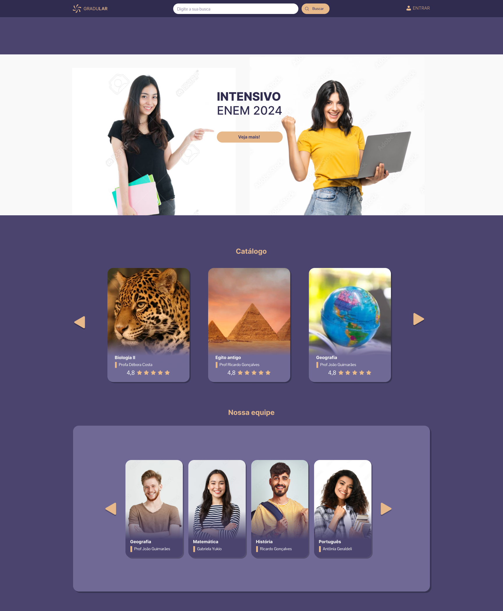

# Gradular

## Projeto
Este é um projeto da disciplina Interação Humano Computador, do curso de Engenharia de Software, a qual eu curso como eletiva. O projeto consiste em ser uma plataforma gratuita com materiais e aulas gratuitas para estudo, tanto para vestibulares como para disciplinas da graduação.
Neste trabalho, contribuirei com o design, HTML e CSS. Este é um projeto em andamento, com previsão de entrega para a primeira semana de novembro de 2024.

 
 
 

